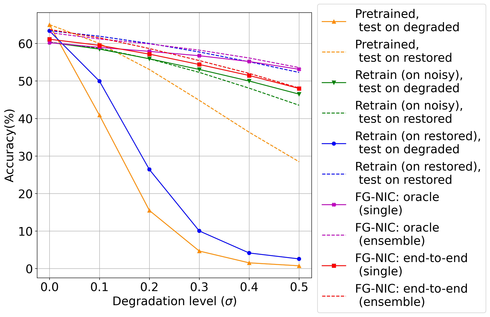
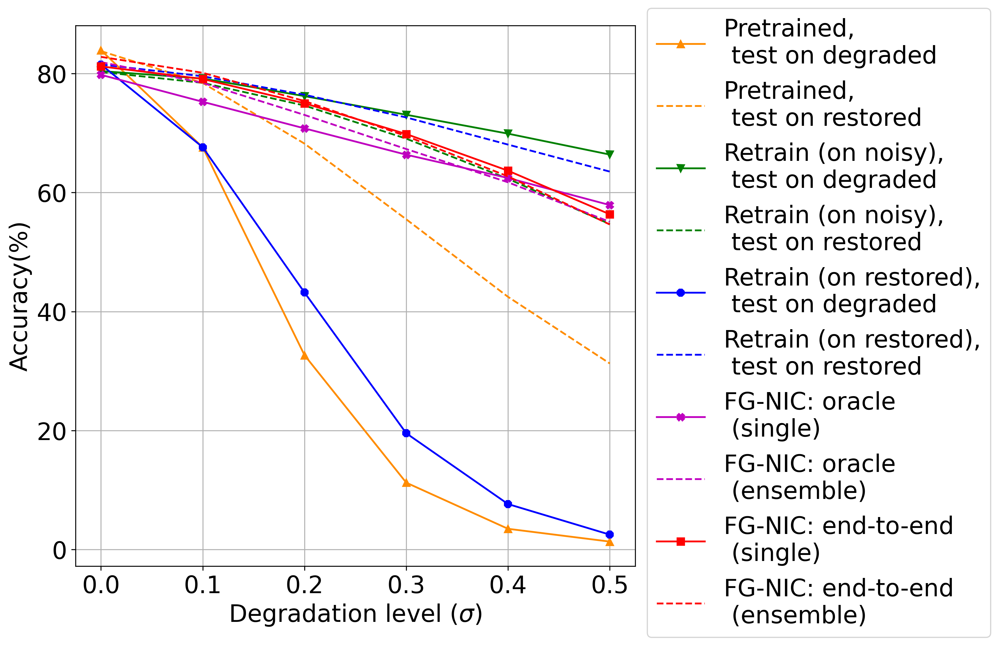

# Fidelity Estimation Improves Noisy Image Classification with Pretrained Networks
**Authors**: Xiaoyu Lin, Deblina Bhattacharjee, Majed El Helou and Sabine Süsstrunk

 


#### [[Paper]](https://github.com/IVRL/FG-NIC) - [[Supplementary]](https://github.com/IVRL/FG-NIC)


> **Abstract:** *Deep learning has achieved significant improvements in recent years for many computer vision tasks, including image classification. This was propelled by large datasets and convolutional networks capable of learning rich feature extractors. However, such methods are developed on clean images and are not robust when handling noisy ones, despite a restoration preprocessing step. While novel methods were recently developed for tackling this problem, they rely on modified feature extractors. In other words, the feature extractor of the classifier needs to be retrained, which is computationally expensive. We propose a method that can be applied to a pretrained classifier. Our method exploits a fidelity map estimate that is fused into the internal feature representations. This fidelity map enables us to adjust the attention of the network, directing it towards features that are faithful to the clean image, and away from those affected by noise and restoration. Our noisy-image classification results improve over the baseline network by significantly large margins, especially at high noise levels, and come close to the fully-retrained approaches. Furthermore, using our oracle fidelity map, we show that our method even outperforms the fully-retrained methods, whether trained on noisy or restored images.*
>

## Table of Contents  
- [Degradation model](#degradation-model)
- [Requirements](#requirements)
- [Model Training and Testing](#model-training-and-testing)
- [Baseline Methods and Ablation Study](#baseline-methods-and-ablation-study)
- [Results](#results)
- [Citation](#citation)

## Degradation model
To explore the effects of degradation types and levels on classification networks, we also implement five types of degradation model: Additive white Gaussian noise (AWGN), Salt and Pepper Noise, Gaussian Blur, Motion Blur and Rectangle Crop. The instruction of those degradatin models is given in [notebook](synthetic_images.ipynb).  

## Requirements
- Python 3.7, PyTorch 2.1.0;
- Other common packages listed in [`requirements.txt`](requirements.txt) or [`environment.yml`](environment.yml).

## Model Training and Testing
### Train Pre-trained sub-models for proposed models
The implemention of classification networks are from [torchvision](https://pytorch.org/docs/stable/torchvision/models.html), and restoration networks is based on [DnCNN](https://github.com/cszn/KAIR), [MemNet](https://github.com/IVRL/DEU).

- To obtain pretrained classification networks:  
`python train.py --task classification --classification resnet50 --dataset caltech256  --num_class 257`  
    - The `--classification` argument takes value in `'resnet50', 'resnet18', 'alexnet', 'googlenet', 'vgg'`;
    - The `--dataset` and ` --num_class` takes value in `'caltech256', 257` and `'caltech101', 101` respectively.  

- To obtain pretrained restoration networks:  
`python train.py --task=restoration --degradation=awgn --restoration=dncnn --level 0 0.5 --batch_size 256`
    - The `--restoration` argument takes value in `'dncnn', 'memnet'`.  
    
- To obtain retrained classification networks on degraded images:  
`python train.py  --task classification --classification resnet50 --degradation awgn --level 0 0.1 0.2 0.3 0.4 0.5`  
    
- To obtain retrained classification networks on restored images:  
`python train.py  --task classification --classification resnet50 --degradation awgn --level 0 0.1 0.2 0.3 0.4 0.5 --restoration dncnn`

- To obtain pre-trained fidelity map estimator:  
`python train.py  --task fidelity --degradation awgn --restoration dncnn --level 0 0.5 --fidelity_input degraded --fidelity_output l1 --batch_size 256 --num_epochs 60`  
    - The `--fidelity_input` argument takes value in `'degraded', 'restored'`;
    - The `--fidelity_output` argument takes value in `'l1', 'l2', 'cos'`.  

### Proposed model
- To train the proposed model:  
`python train.py  --task model --mode oracle --classification resnet50 --degradation awgn --restoration dncnn --level 0 0.1 0.2 0.3 0.4 0.5 --fidelity_input degraded --fidelity_output l1 --num_epochs 60  --dataset caltech256 --num_class 257`  
    - The `--mode` argument takes value in `'endtoend-pretrain', 'pretrain', 'oracle'`
    
- To test the proposed model:  
`python test.py --task model --mode oracle --classification resnet50 --degradation awgn --level 0.1 --restoration dncnn --fidelity_input degraded --fidelity_output l1 --is_ensemble True`
    - The `--is_ensemble` argument takes value in `'True', 'False'`

## Baseline Methods and Ablation Study
- We provide four baseline methods for comprehensive analysis. To train and test baseline methods:
    - [WaveCNet](https://github.com/LiQiufu/WaveCNet)
        - train: `python train.py  --task wavecnet --classification resnet50`;
        - test: `python test.py  --task wavecnet --classification resnet50 --degradation awgn --level 0.1`;
    - [DeepCorrect](https://github.com/tsborkar/DeepCorrect)
        - train: `python train.py  --task deepcorrect --classification resnet50 --degradation awgn --level 0 0.1 0.2 0.3 0.4 0.5 --num_epochs 60`;
        - test: `python test.py  --task deepcorrect --classification resnet50 --degradation awgn --level 0.1`.

- We also provide some in-depth analysis and ablation study models:
    - To try different fidelty map inputs and outputs, you can use the `--fidelity_input` and `--fidelity_output` arguments;
    - To try different downsampling methods, you can use the `--downsample` argument which takes value in `'bicubic', 'bilinear', 'nearest'`;
    - For ablation study, you can use the `--ablation` argument which takes value in `'spatialmultiplication' 'residualmechanism' 'spatialaddition' 'channelmultiplication' 'channelconcatenation'`;
    - **Note**: For more details of ablation study models, please refer to our paper.  
    
## Results
Except results in our main paper and supplementary materials, we illustrate the performances of the proposed method on other classification network (e.g. AlexNet in figure below on the left) and restoration network (e.g. MemNet in figure below on the right). The performances of the proposed method on other networks are similar to that on ResNet-50 and DnCNN in our paper, which demonstrates the proposed method is model-agnostic which can be used by other networks.

<p align="center">
  
  
</p>

Above figure on the left: Classification results with the AlexNet classification and DnCNN restoration network, on Caltech-256 dataset, for various setups. The solid lines indicate testing directly on noisy images. The dashed lines indicate testing with the DnCNN restoration preprocessing step. Best viewed on screen.  
Above figure on the right: Classification results with the ResNet-50 classification and MemNet restoration network, on Caltech-256 dataset, for various setups. The solid lines indicate testing directly on noisy images. The dashed lines indicate testing with the DnCNN rest
## Citation

```bibtex

```